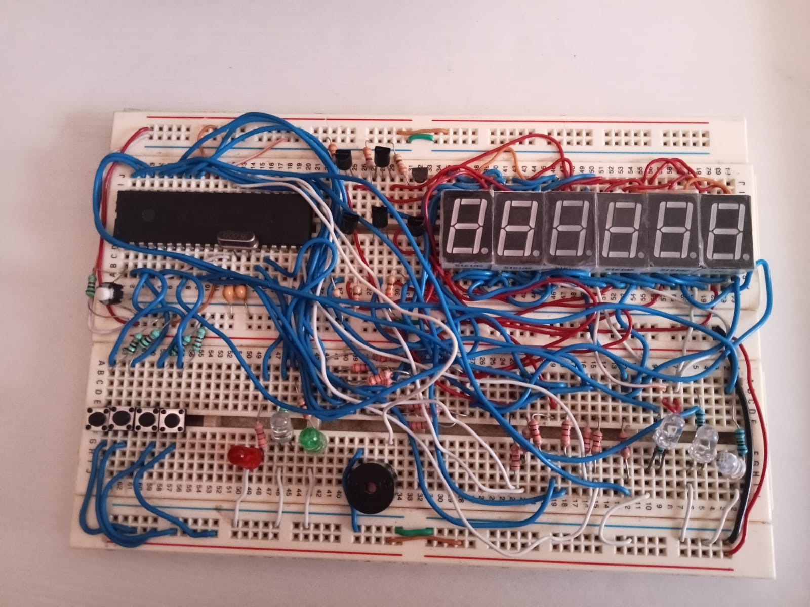
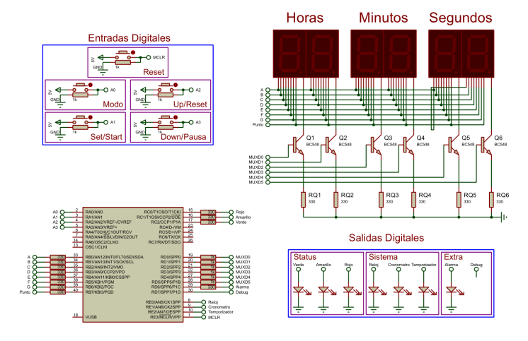

# ⏰ Proyecto: Reloj Multifunción en PIC18F4550



## 📌 Descripción
Este proyecto implementa un **reloj multifunción** utilizando el microcontrolador **PIC18F4550**.  
Cuenta con tres funcionalidades principales, ejecutándose en segundo plano:

✅ **Reloj** - Muestra la hora en tiempo real.  
✅ **Cronómetro** - Permite iniciar, pausar y reiniciar la cuenta.  
✅ **Temporizador** - Configura un tiempo regresivo con alarma al finalizar.  

---

## 🛠 **Tecnologías y Herramientas**
- ⚡ **Microcontrolador:** PIC18F4550  
- 🔌 **Lenguaje:** C (MPLAB X + XC8)  
- 🔧 **Compilador:** XC8  
- 🎛 **Simulación:** Proteus / MPLAB X  
- 📟 **Display:** LCD 16x2 / 7 segmentos  

---


## Resuen General


* **Configuración del Microcontrolador:**

Se programa el PIC18F4550 para trabajar con un oscilador a 48 MHz, con lógica positiva en las entradas y salidas digitales.
Se activan diferentes pines para entradas digitales (con botones) y salidas de estado (con LEDs).

1. Entradas Digitales:
Botones configurados en modo pull-down para seleccionar y ajustar las opciones de funcionamiento:

2. Modo: 
Selecciona entre reloj, cronómetro, temporizador o deshabilitado.
Set/Start: Configura valores de hora o inicia el conteo.
Up/Reset: Incrementa valores o reinicia el conteo.
Down/Pausa: Decrementa valores o pausa el conteo.

4. Salidas:
LEDs para mostrar el estado del sistema y el modo activo.
Una alarma que se activa en el temporizador al finalizar un conteo.

5. Pantalla LCD:
Controlada en modo de 4 bits, muestra información como la hora actual, las acciones del usuario, y el conteo del cronómetro o temporizador.

***

* **Modos de Operación:**

    1. Reloj: Configurable por el usuario; muestra la hora en formato HH:MM:SS y permite ajustes.

    2. Cronómetro: Cuenta el tiempo de forma ascendente, con opciones para iniciar, pausar y reiniciar.

    3. Temporizador: Cuenta hacia atrás desde un tiempo configurado; activa una alarma al finalizar.

    4. Deshabilitado: Apaga todas las salidas y funciones.

* **Firmware:**

    * Implementado en MPLAB, el código controla las operaciones y la interacción entre entradas, salidas y la pantalla LCD.


## 📄 **Esquematico**




---

## 📂 **Estructura del Proyecto**
```plaintext
📦 Reloj_PIC18F4550
├── 📁 src               # Código fuente
│   ├── main.c           # Programa principal
│   └── header.h       # Configuración del PIC
├── 📁 docs              # Documentación
│   ├── diagrama_circuito.png  # Esquemático del circuito
│   ├── diagrama_flujo.pdf     # Diagramas de flujo
├── 📁 simulacion        # Archivos para simulación en Proteus
└── README.md            # Este archivo
